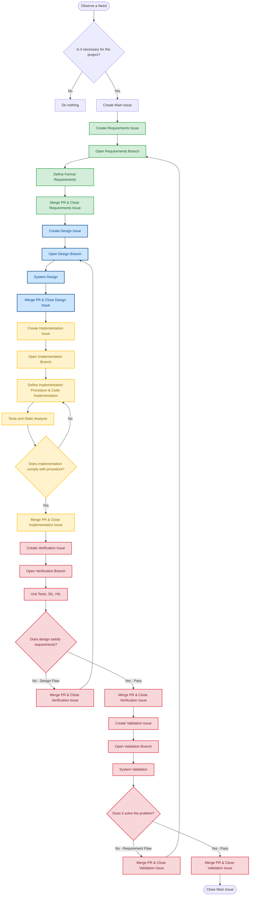

# Contributing & Engineering Methodology

> Note: This repository reflects an exploratory Proof of Concept (PoC) / MVP developed to validate hardware integration on legacy silicon. The core architecture is being systematically redesigned under formal system engineering principles.

## 1. Core Philosophy: Engineering as Applied Science

At ELI_galileo, we **reject ad-hoc hacking and trial-and-error development**. Engineering is the **scientific method applied to creation**. While natural sciences use the scientific method for **discovery**, engineering uses an **isomorphic application** of the same logical rigor for **creation**. **Any attempt to bypass, subvert, or break the scientific method within this project will be indefinitely vetoed.**

We operate under both formal expressions of the scientific method:

### A. The Scientific Method of Discovery (Understanding Reality)
1. **Observation**: Identifying a physical or operational phenomenon.
2. **Hypothesis**: Proposing a model or explanation for the phenomenon.
3. **Experiment Design**: Setting up controlled conditions to test the model.
4. **Experimentation**: Execution and data gathering.
5. **Data Consistency Verification**: Ensuring experimental data is sound and repeatable.
6. **Hypothesis Validation**: Confirming or refuting the proposed model.
7. **Natural Law / Theory**: Establishing reliable principles.

### B. The Scientific Method of Creation (Engineering & Synthesis)
1. **Requirements (Hypothesis of Need)**: Define the problem to solve and the constraints to meet (e.g., Phase 0/A MDD & URD).
2. **Behavioral Design**: Architect the system behavior to satisfy the requirements without violating physical or logical boundaries (SRS & Architecture).
3. **Implementation/Manufacturing Procedure**: Formulate the rigorous, reproducible steps required to build the artifact (coding standards, MISRA-C, Power of 10, build pipelines).
4. **Implementation / Execution**: Fabricate or code the artifact according to the procedure.
5. **Procedure Verification**: Confirm that the artifact was built *exactly* as specified by the procedure (static analysis, unit testing).
6. **Behavioral Validation**: Prove that the artifact's behavior matches the original requirements (via SITL and HITL testing).
7. **Prototype / Product Integration**: Deploy the validated artifact into its operational plant environment (e.g., UAV flight integration).

---

## 2. Standards as Guardrails

While the scientific method provides the underlying logic, **industrial and aerospace standards** (e.g., **ECSS**, **MISRA-C**, **NASA Power of 10**) serve as our **operational guardrails**. These standards:

- Eliminate ambiguity.
- Enforce determinism.
- Prevent systemic errors before code touches silicon.

---

## 3. Repository Workflow Procedure

To maintain the integrity of this methodology, all contributions and changes must follow a **rigorous lifecycle** mirroring the scientific method of creation:

### 1. **Issue Tracking**
- **No change**, refactoring, or feature is implemented **without a prior formal Issue** detailing its rationale and traceability.
- All Issues must include:
  - A **clear and formal description** of the problem or enhancement.
  - **Traceability to requirements** (if applicable).
  - **Impact analysis** on system behavior, safety, and performance.
- **Lifecycle Transition:** Sub-issues (Requirements, Design, Implementation) are reviewed, validated, and **closed exclusively via Pull Request (PR)** merge.

### 2. **Branching Strategy**
- **Feature/Task branches** must stem from ongoing baselines using **descriptive names**, such as:
  - `docs/urd_draft`
  - `feat/sensor-fusion`
  - `bugfix/i2c-daemon-crash`
- Branches must be **clearly documented** in the associated Issue.

### 3. **Documentation-Driven Engineering**
- **Requirements and design specifications** must be updated **before** code implementation.
- **Traceability links** must be maintained between requirements and verification artifacts (e.g., unit tests, static analysis rules).

### 4. **Code Quality Gates**
- **Zero dynamic memory allocation**: `malloc`, `free`, or any heap usage is **strictly prohibited**.
- **Full compliance** with static analysis rules and coding guidelines.
- **Verification through reproducible testing procedures**.

### 5. **Review & Merge**
- All **code and documentation** are subject to **peer/architectural review** before merging into the main line.
- **No merge** is allowed without:
  - A successful **CI pipeline** (static analysis, unit tests, packaging).
  - **Traceable documentation** updates.
  - **Compliance with standards** (MISRA-C, ECSS, etc.).
  - Every Pull Request for Implementation, Verification, or Validation must include the corresponding execution logs, test reports, or traceability matrices as mandatory artifacts before review and merge.

---

## 4. Commit Message Guidelines

Standardized commit messages are enforced to ensure clarity and traceability. The use of **Conventional Commits** is encouraged.

**Format:** `<type>(<scope>): <description>`

- **type**:
  - `feat`: A new feature or enhancement.
  - `fix`: A bug fix.
  - `docs`: Documentation only changes.
  - `style`: Changes that do not affect the meaning of the code (whitespace, formatting, etc.).
  - `refactor`: A code change that neither fixes a bug nor adds a feature.
  - `test`: Adding a missing test or correcting existing tests.
  - `chore`: Maintenance tasks, build system updates, etc.
- **scope** (optional): The specific module affected (e.g., `i2c-daemon`, `buildroot-script`, `docs`).
- **description**: A short, imperative tense description of the change.

**Examples:**
- `feat(i2c-daemon): Add support for the new sensor model`
- `docs(readme): Update CI badge URL`
- `fix(buildroot-script): Ensure .deb artifact is downloaded correctly`

---

## 5. Pull Request (PR) Checklist

Before submitting your Pull Request, please ensure the following:

- [ ] **Code Builds Successfully:** Your changes compile correctly using the cross-compilation toolchain.
- [ ] **CI Pipeline passes:** The GitHub Actions workflow must pass all steps (static analysis, unit tests, packaging) successfully.
- [ ] **Unit Tests Added/Passed:** You have added relevant unit tests for new features/fixes, and all existing tests pass.
- [ ] **Documentation Updated:** `README.md` or other relevant documentation is updated to reflect your changes.
- [ ] **MISRA Compliance:** C/C++ code adheres to project programming guidelines (checked by CppCheck in CI).
- [ ] **Traceability Links:** All changes are traceable to formal requirements or design documents.
- [ ] **Binary Audit Completed:** Any example or reference implementation in the repository has passed a static/WCET audit.

---

## 6. Reporting Issues

If you find a bug or have a feature request, please open a new issue with the following information:

- **Title**: Clear and concise.
- **Description**: Detailed and traceable to a requirement or design document.
- **Impact Analysis**: Potential system impact, safety, or performance considerations.
- **Reproduction Steps**: If applicable, provide steps to reproduce the issue.

Thank you for your contribution!